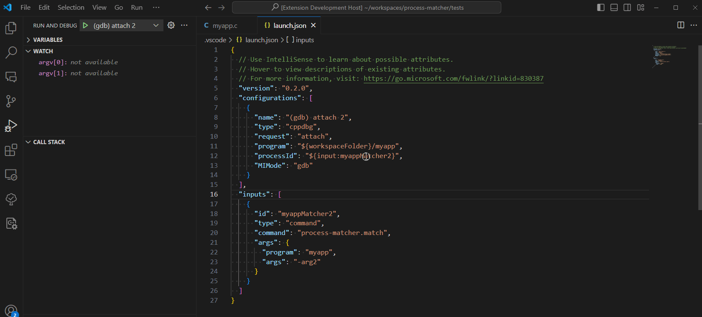

# process-matcher
process-matcher filters running processes by name, and get processId to be used in attach debug configuration.

## Features
Filters processes by:
* Program name
* Arguments to program

## Extension Settings
The extension creates command `process-matcher.match`, that takes the following options:
* `program`: name of the program to match
* `args`: arguments of the program to match

## Notes
* If number of matched processes is one, then it will automatically pick its PID.
* If number of matched processes is more than one, then it will display a process picker with all matched processes.

## Example
launch.json
```
{
  "version": "0.2.0",
  "configurations": [
    {
      "name": "(gdb) attach myApp",
      "type": "cppdbg",
      "request": "attach",
      "program": "${workspaceFolder}/myApp",
      "processId": "${input:myAppMatcher}"
      "MIMode": "gdb"
    }
  ],
  "inputs": [
    {
      "id": "myAppMatcher",
      "type": "command",
      "command": "process-matcher.match",
      "args": { "program": "myApp" }
    }
  ]
}
```

## Demo
1 - Matched multiple processes


2 - Matched single process

